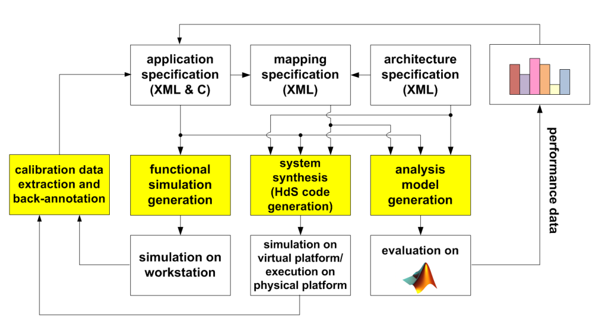
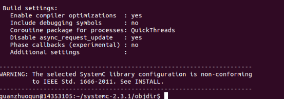
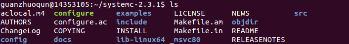
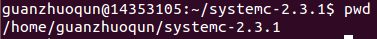
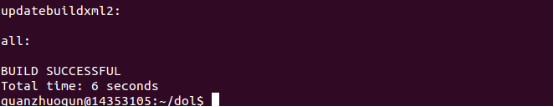
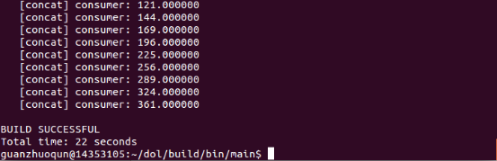

#Dol配置实验
###一、Dol框架描述
 **The distributed operation layer (DOL)** is a software development framework to program parallel applications. The DOL allows to specify applications based on the Kahn process network model of computation and features a simulation engine based on SystemC. Moreover, the DOL provides an XML-based specification format to describe the implementation of a parallel application on a multi-processor systems, including binding and mapping. The DOL consists of basically three parts: 
- **DOL Application Programming Interface**: The DOL defines a set of computation and communication routines that enable the programming of distributed, parallel applications for the SHAPES platform. Using these routines, application programmers can write programs without having detailed knowledge about the underlying architecture. In fact, these routines are subject to further refinement in the hardware dependent software (HdS) layer.  
- **DOL Functional Simulation**: To provide programmers a possibility to test their applications, a functional simulation framework has been developed. Besides functional verification of applications, this framework is used to obtain performance parameters at the application level.  
- **DOL Mapping Optimization**: The goal of the DOL mapping optimization is to compute a set of optimal mappings of an application onto the SHAPES architecture platform. In a first step, XML based specification formats have been defined that allow to describe the application and the architecture at an abstract level. Still, all the information necessary to obtain accurate performance estimates is contained. 

###二、Dol安装过程
#####  安装VMWARE和Ubuntu
- VMWARE教程：[enter link description here](http://jingyan.baidu.com/article/0320e2c1ef9f6c1b87507bf6.html)
- Ubuntu官网下载：[enter link description here](http://www.ubuntu.com/download/desktop)
如果Ubuntu连不上网，可参考以下教程[Vmware+Ubuntu上网](http://www.linuxidc.com/Linux/2011-10/44546p2.htm)
或直接用已经配备的ubuntu直接导入（链接: http://pan.baidu.com/s/1eSI7Kye）

#####  安装必要的环境
- `sudo apt-get update`
- `sudo apt-get install ant`
- `sudo apt-get install openjdk-7-jdk`
- `sudo apt-get install unzip`

#####  在Ubuntu中下载system-2.3.1.tgz和dol_ethz.zip压缩包。使用以下语句
- sudo wget http://www.accellera.org/images/downloads/standards/systemc/systemc-2.3.1.tgz
- sudo wget http://www.tik.ee.ethz.ch/~shapes/downloads/dol_ethz.zip

#####  解压system-2.3.1.tgz和dol_ethz.zip
- 新建dol的文件夹 
`$	mkdir dol`
- 将dolethz.zip解压到 dol文件夹中
`$	unzip dol_ethz.zip -d dol`
- 解压systemc
`$	tar -zxvf systemc-2.3.1.tgz`

#####  编译systemc
- 解压后进入systemc-2.3.1的目录下
`$	cd systemc-2.3.1`
- 新建一个临时文件夹objdir
`$	mkdir objdir`
- 进入该文件夹objdir
`$	cd objdir`
- 运行configure(能根据系统的环境设置一下参数，用于编译)，得到以下结果图

- 编译
`$	sudo make install`
编译完成后，得到以下目录

- 输入pwd，记下当前工作路径

#####  编译dol
- 进入dol文件夹，打开build_zip.xml文件，**找到下面这段代码**，将其中的YYY改成上一个步骤记下的路径（**对于64位系统的机器，需要将lib-linux要改成lib-linux64**）
`<property name="systemc.inc" value="YYY/include"/>
<property name="systemc.lib" value="YYY/lib-linux/libsystemc.a"/>`

- 编译
`$	ant -f build_zip.xml all`
运行这个语句，如果成功，将会显示build successful，如下图所示

- 尝试运行第一个例子
进入build/bin/mian路径下，然后运行第一个例子
`$	cd build/bin/main`
`$	ant -f runexample.xml -Dnumber=1`
得到如下效果图，Dol就配置成功了

###三、实验感想   
   这次实验，我遇到的问题主要是在安装环境的配置上。我一开始装的是Ubuntu14.04，但是装完之后发现连不上网。根据网上的教程做了一遍之后都没什么用，最后我是用TA配置好的Ubuntu直接导入。在进行之后的Dol配置中，可能因为我是直接把命令拷贝进去，所以避免了因缺少空格而导致一些错误的发生，基本上一路安装下来都没有遇到什么困难。

