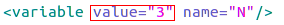

##Lab2：Dol实例分析&编程
####一、实验任务
- 修改example1，使其输出3次方数
- 修改example2，让3个square模块变成2个
####二、实验步骤
- ***example1***
 在原来的square模块中，返回的是2次方数，其实现如下：
 
 
 
        现在要使输出的结果为输入值的3次方，只需要将上面的i=i*i部分改为i=i*i*i即可。

- ***example2***
在example2中，要使程序中的3个square模块变成2个模块，只需要更改example.xml中的square模块数以及相应的通道和连接。又因为在example2中是通过迭代的方法去定义square模块和生成相应的通道和连接，所以只需要更改迭代次数即可。具体如下：

         将上面的value值改为2.
####三、实验结果
 ***example1***
- 输出结果

- dot图

***example2***
- 输出结果

- dot图

####四、实验感想   
   这次实验修改的内容比较的简单，主要是要了解不同模块的内部实现以及模块间的连接方式，就能比较快的完成实验。我花时间比较多的地方主要是在弄清example2的不同模块之间是怎么通过迭代的方式实现连接。

