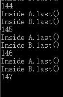

##Lab4：死锁
####一、死锁的四个必要条件
- **死锁**： 是指两个或两个以上的进程在执行过程中，由于竞争资源或者由于彼此通信而造成的一种阻塞的现象，若无外力作用，它们都将无法推进下去。此时称系统处于死锁状态或系统产生了死锁，这些永远在互相等待的进程称为死锁进程。
- 产生死锁的四个必要条件：
1、互斥条件：一个资源每次只能被一个进程使用。
2、占有且等待：一个进程因请求资源而阻塞时，对已获得的资源保持不放。
3、不可强行占有:进程已获得的资源，在末使用完之前，不能强行剥夺。
4、循环等待条件:若干进程之间形成一种头尾相接的循环等待资源关系。
这四个条件是死锁的必要条件，只要系统发生死锁，这些条件必然成立，而只要上述条件之一不满足，就不会发生死锁。
####二、测试程序结果截图及分析
- 实验结果

- 结果分析
当执行到第147次时发生死锁。
当程序执行t.start()后，Deadlock（）执行while语句，处于block状态。此后执行run（）程序，调用对象b的方法methodB，当methodB还未执行a.last()时，Deadlock（）的while循环结束，CPU资源又分给Deadlock（），执行对象a的方法methodA。因为b.last()方法不能执行，所以Deadlock（）阻塞，CPU资源分给run（）。又因为a.last()的方法不能执行，所以run（）也被阻塞。最后，造成死锁发生。
 

