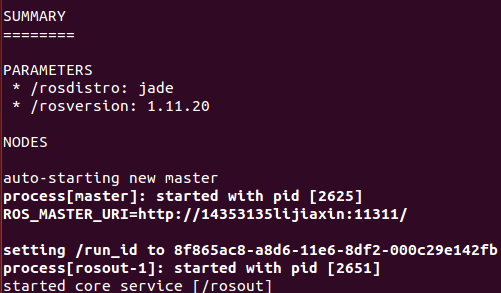
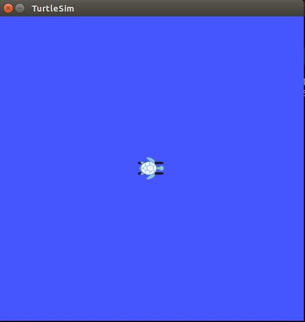
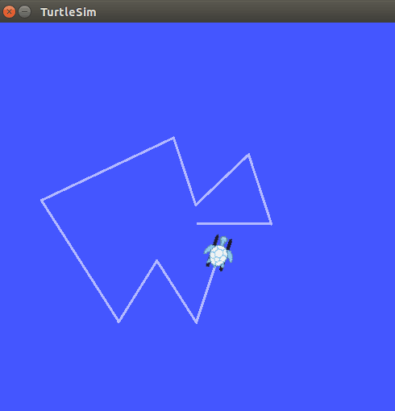

##                Ubuntu 安装ROS
###1.  安装
####1.1  配置Ubuntu的软件库
- 配置Ubuntu的软件库，允许"restricted," "universe," and "multiverse." 
####1.2  设置sources.list
- 执行以下语句对Ubuntu进行设置，使电脑能够从packages.ros.org下载软件
`sudo sh -c 'echo "deb http://packages.ros.org/ros/ubuntu $(lsb_release -sc) main" > /etc/apt/sources.list.d/ros-latest.list' `
####1.3  设置key
- `sudo apt-key adv --keyserver hkp://ha.pool.sks-keyservers.net:80 --recv-key 0xB01FA116`
####1.4  安装
- 确认Debian 包索引是最新的
`sudo apt-get update`

- ROS有不同的库和工具，这里提供了四种默认配置。
（1） Desktop-Full Install: (Recommended) : ROS, rqt, rviz, robot-generic libraries, 2D/3D simulators, navigation and 2D/3D perception 
`sudo apt-get install ros-jade-desktop-full`
（2） Desktop Install: ROS, rqt, rviz, and robot-generic libraries 
`sudo apt-get install ros-jade-desktop`
（3） ROS-Base: (Bare Bones) ROS package, build, and communication libraries. No GUI tools. 
`sudo apt-get install ros-jade-ros-base`
（4） Individual Package：安装特定的ROS包
`sudo apt-get install ros-jade-PACKAGE`

- 使用以下语句找到可用的包
`apt-cache search ros-jade`

####1.5  初始化rosdep 
- 初始化rosdep可以更容易地安装ROS中需要编译和运行的系统依赖源
 ```sudo rosdep init
rosdep update```

####1.6  环境设置
- 执行以下语句能使ROS环境变量自动添加到bash session中
```echo "source /opt/ros/jade/setup.bash" >> ~/.bashrc
source ~/.bashrc```

####1.7  获取rosinstall
- rosinstall是ROS中常用的命令行工具。有了它可以更容易地下载ROS包的源树。这个工具可以通过以下工具获取。
`sudo apt-get install python-rosinstall`

###2.  测试
- 执行roscore
roscore是在使用ros之前应该首先运行的程序。在终端运行roscore。
`roscore`
运行结果如下：


- 输入以下命令，你将会在屏幕上看到一只乌龟  
`rosrun turtlesim turtlesim_node`
效果图如下：



- 输入以下命令，通过键盘控制乌龟运动
`rosrun turtlesim turtle_teleop_key`
效果图如下：



##3.  实验感想
安装整个过程还是比较顺利，除了安装有点久外。